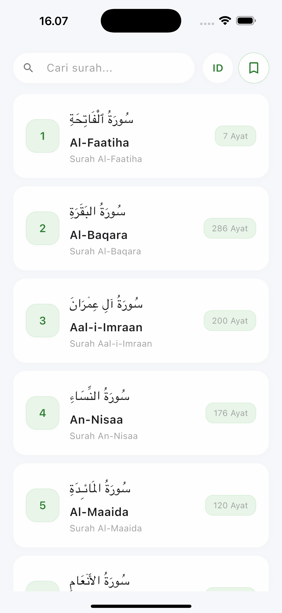
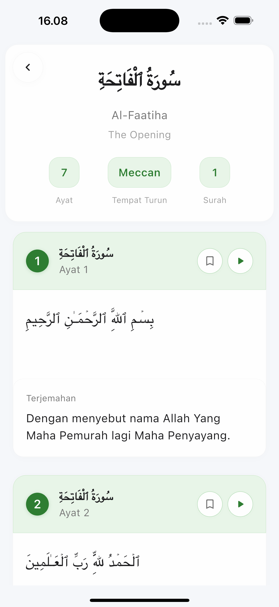
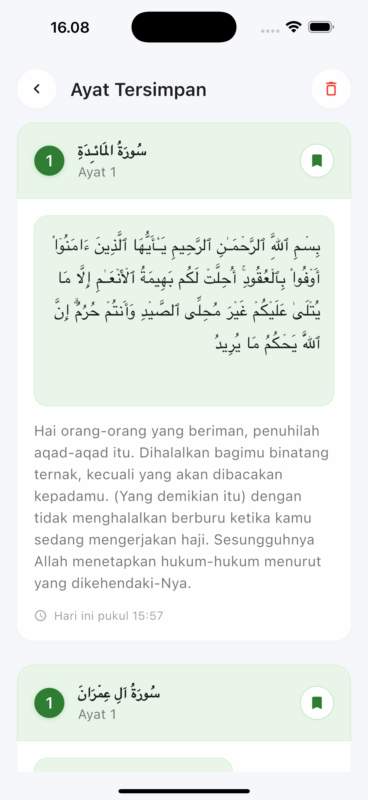

# 📖 Al-Quran App - Proyek Demo

> **⚠️ DISCLAIMER: Ini adalah proyek DEMO untuk menampilkan kemampuan coding. Tidak ditujukan untuk penggunaan produksi atau keperluan agama.**

Aplikasi mobile Flutter yang indah untuk membaca Al-Quran dengan desain UI/UX modern. Proyek ini mendemonstrasikan kemampuan pengembangan Flutter tingkat lanjut termasuk manajemen state, integrasi API, pemutaran audio, dan desain responsif.

## 🎯 Ikhtisar Proyek

Ini adalah **PROYEK DEMONSTRASI** yang dibuat oleh [CodingGeh](https://github.com/codinggeh) untuk menampilkan:
- Kemampuan pengembangan Flutter
- Prinsip desain UI/UX modern
- Kemampuan integrasi API
- Manajemen state dengan Provider
- Fungsi pemutaran audio
- Dukungan multi-bahasa
- Pola desain responsif

## 🚀 Fitur

### 📱 Fitur Utama
- **Bacaan Al-Quran Lengkap**: Semua 114 surah dengan teks Arab dan terjemahan
- **Dukungan Multi-bahasa**: Terjemahan Bahasa Indonesia dan Inggris
- **Rekaman Audio**: Dengarkan bacaan Al-Quran yang indah oleh Sheikh Mishary Rashid Alafasy
- **Sistem Bookmark**: Simpan dan kelola ayat favorit Anda
- **Fungsi Pencarian**: Temukan surah berdasarkan nama atau terjemahan
- **UI Modern**: Desain responsif yang indah dengan animasi halus

### 🎨 Fitur UI/UX
- **Tema Gelap/Terang**: Sistem tema adaptif
- **Animasi Halus**: Transisi fade dan slide
- **Desain Responsif**: Berfungsi di semua ukuran layar
- **Pull-to-Refresh**: Refresh konten yang mudah
- **Status Loading**: Indikator loading profesional
- **Penanganan Error**: Pesan error yang ramah pengguna

### 🔧 Fitur Teknis
- **Manajemen State**: Implementasi pola Provider
- **Integrasi API**: Multiple endpoint API RESTful untuk terjemahan
- **Streaming Audio**: Pemutaran audio real-time
- **Penyimpanan Lokal**: Data bookmark persisten
- **Internasionalisasi**: Dukungan i18n dengan API terjemahan terpisah
- **Penanganan Error**: Manajemen error komprehensif

## 🛠️ Stack Teknologi

### Frontend
- **Flutter**: 3.32.2 (Stable terbaru)
- **Dart**: 3.8.1
- **Provider**: Manajemen state
- **Easy Localization**: Dukungan i18n

### Audio & Media
- **just_audio**: Pemutaran audio
- **audio_session**: Manajemen sesi audio

### UI & Design
- **Material Design 3**: Sistem desain modern
- **Animasi Kustom**: Transisi fade dan slide
- **Layout Responsif**: Desain adaptif

### Data & Storage
- **SharedPreferences**: Persistensi data lokal
- **HTTP**: Komunikasi API
- **JSON**: Serialisasi data

## 📡 Integrasi API

Aplikasi ini menggunakan **AlQuran Cloud API** untuk data Al-Quran:

- **Base URL**: `https://api.alquran.cloud/v1`
- **Dokumentasi**: [AlQuran Cloud API](https://alquran.cloud/api)
- **Sumber Audio**: Rekaman Sheikh Mishary Rashid Alafasy

### Endpoint API yang Digunakan
- `GET /surah` - Mendapatkan semua surah
- `GET /surah/{number}` - Mendapatkan surah tertentu dengan teks Arab
- `GET /surah/{number}/id.indonesian` - Mendapatkan terjemahan Bahasa Indonesia
- `GET /surah/{number}/en.sahih` - Mendapatkan terjemahan Bahasa Inggris
- `GET /ayah/{number}/ar.alafasy` - Mendapatkan URL audio ayat
- `GET /surah/{number}/ar.alafasy` - Mendapatkan URL audio surah

## 📱 Screenshot

### Layar Utama


### Detail Surah


### Bookmark


## 🚀 Memulai

### Prasyarat
- Flutter SDK 3.32.2 atau lebih tinggi
- Dart 3.8.1 atau lebih tinggi
- Android Studio / VS Code
- iOS Simulator / Android Emulator

### Instalasi

1. **Clone repository**
   ```bash
   git clone https://github.com/codinggeh/alquran_app_flutter_example.git
   cd alquran_app_flutter_example
   ```

2. **Install dependencies**
   ```bash
   flutter pub get
   ```

3. **Jalankan aplikasi**
   ```bash
   flutter run
   ```

### Build untuk Produksi
```bash
# Android
flutter build apk --release

# iOS
flutter build ios --release
```

## 📁 Struktur Proyek

```
lib/
├── main.dart                 # Entry point aplikasi
├── models/                   # Model data
│   ├── surah_model.dart     # Model Surah dan Ayah
│   └── bookmark_model.dart  # Model Bookmark
├── providers/               # Manajemen state
│   ├── quran_provider.dart  # Provider data Al-Quran
│   ├── audio_provider.dart  # Provider pemutaran audio
│   ├── bookmark_provider.dart # Manajemen bookmark
│   └── theme_provider.dart  # Manajemen tema
├── services/                # Layanan API
│   ├── quran_service.dart   # Layanan API Al-Quran
│   ├── audio_service.dart   # Layanan API audio
│   └── bookmark_service.dart # Layanan penyimpanan lokal
├── screens/                 # Layar UI
│   ├── home_screen.dart     # Layar utama
│   ├── surah_detail_screen.dart # Detail surah
│   └── bookmarks_screen.dart # Layar bookmark
├── widgets/                 # Widget yang dapat digunakan kembali
│   ├── surah_card.dart      # Item list surah
│   ├── ayah_card.dart       # Tampilan ayat
│   ├── bookmark_card.dart   # Item bookmark
│   └── ...                  # Komponen UI lainnya
└── utils/                   # Utilitas
    ├── app_colors.dart      # Definisi warna
    ├── constants.dart       # Konstanta aplikasi
    └── text_styles.dart     # Gaya tipografi
```

## 🔧 Konfigurasi

### Setup Lingkungan
- Tidak memerlukan API key (menggunakan API publik)
- Koneksi internet diperlukan untuk data Al-Quran
- Audio memerlukan internet untuk streaming

### Lokalisasi
- Bahasa yang didukung: Inggris, Indonesia
- Mudah menambah bahasa lain melalui `assets/i18n/`

## 📄 Lisensi

Proyek ini dilisensikan di bawah MIT License - lihat file [LICENSE](LICENSE) untuk detailnya.

## ⚠️ Disclaimer Penting

### Hanya untuk Demo
- Aplikasi ini dibuat **HANYA untuk tujuan demonstrasi**
- Menampilkan kemampuan coding dan pengembangan Flutter
- **TIDAK ditujukan untuk penggunaan produksi**
- **TIDAK ditujukan untuk keperluan agama**

### Tanpa Jaminan
- Developer tidak memberikan jaminan tentang akurasi konten Al-Quran
- Pengguna harus memverifikasi teks dan terjemahan Al-Quran dari sumber resmi
- Developer tidak bertanggung jawab atas interpretasi agama apapun

### Penggunaan API
- Menggunakan AlQuran Cloud API publik
- Ketentuan dan kondisi API berlaku
- Tidak ada jaminan ketersediaan atau akurasi API

### Penggunaan Edukasi
- Proyek ini untuk tujuan pembelajaran dan portfolio
- Silakan pelajari kode dan belajar darinya
- Harap hormati sifat edukatif proyek ini

## 🤝 Kontribusi

Ini adalah proyek demo, tetapi kontribusi untuk tujuan edukasi dipersilakan:

1. Fork repository
2. Buat branch fitur
3. Lakukan perubahan Anda
4. Submit pull request

## 📞 Kontak

- **Developer**: CodingGeh
- **GitHub**: [@codinggeh](https://github.com/codinggeh)
- **Repository**: [alquran_app_flutter_example](https://github.com/codinggeh/alquran_app_flutter_example)

## 🙏 Ucapan Terima Kasih

- **AlQuran Cloud API** untuk menyediakan data Al-Quran
- **Sheikh Mishary Rashid Alafasy** untuk rekaman yang indah
- **Tim Flutter** untuk framework yang luar biasa
- **Komunitas Open Source** untuk berbagai package yang digunakan

---

**Catatan**: Proyek ini dibuat murni untuk tujuan edukasi dan demonstrasi. Silakan gunakan aplikasi Al-Quran resmi untuk keperluan agama. 